# Automarket

Fullstack car marketplace application built with Laravel and TypeScript.

Automarket is a modern SPA marketplace where users can register, verify their email, manage their profile, and create car listings with image uploads.

---

## Live Demo

Coming soon.

---

## SCREENSHOTS

## Desktop:

## Homepage
<p align="center">
  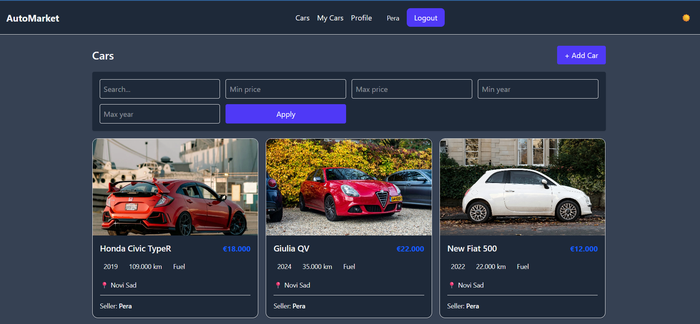
</p>

## HomePageLight
<p align="center">
  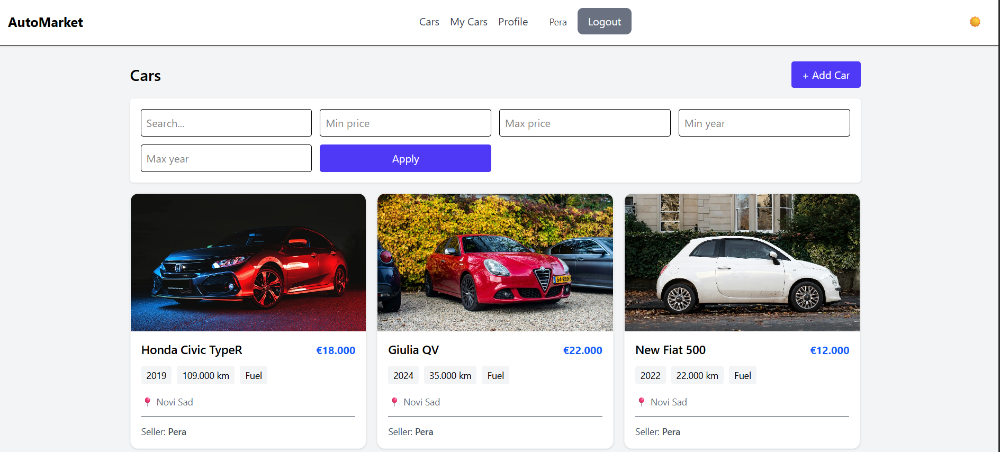
</p>

## OneCar
<p align="center">
  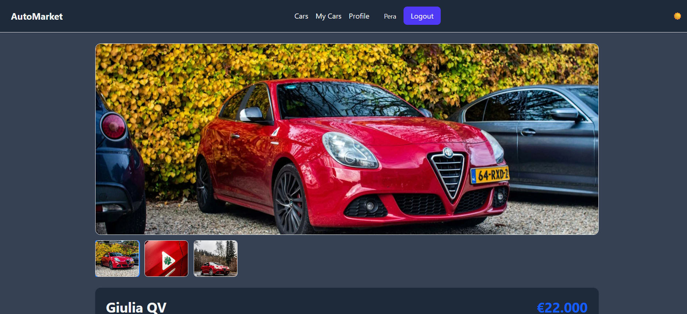
</p>

## MyCar
<p align="center">
  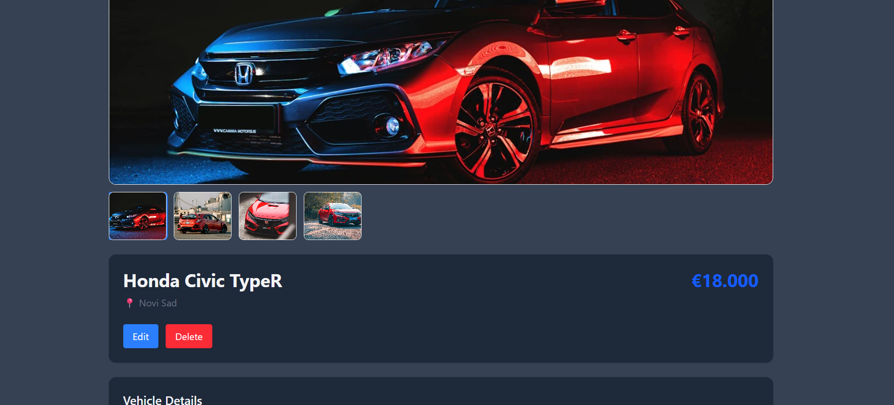
</p>

## CarDetails
<p align="center">
  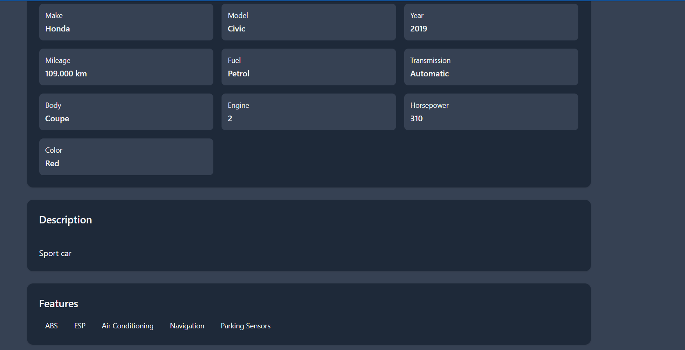
</p>

## Footer
<p align="center">
  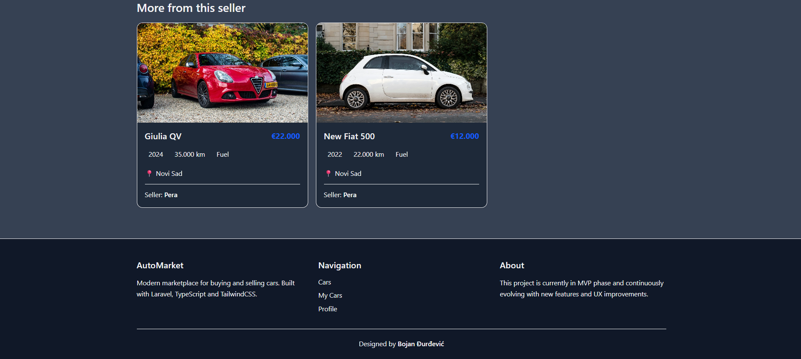
</p>

## Manage Images
<p align="center">
  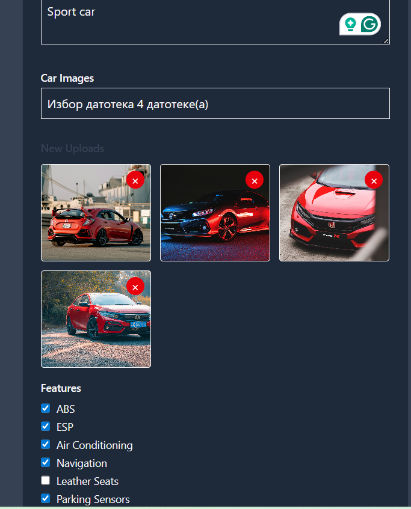
</p>

## Profile Dark
<p align="center">
  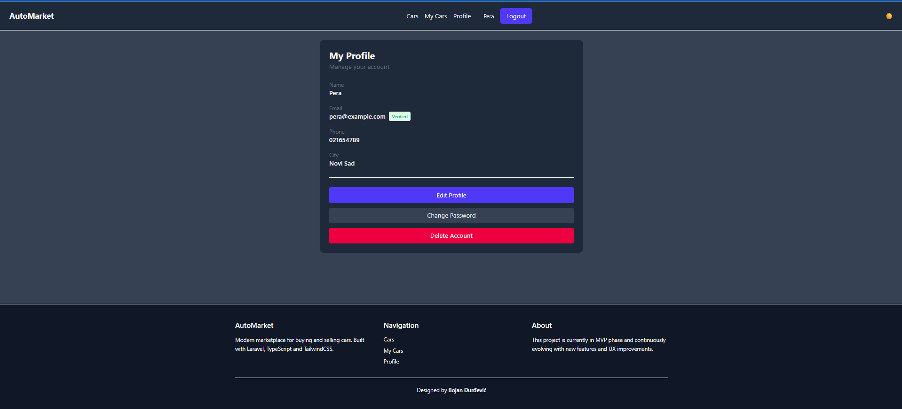
</p>

## Mobile:

## HomeMobile
<p align="center">
  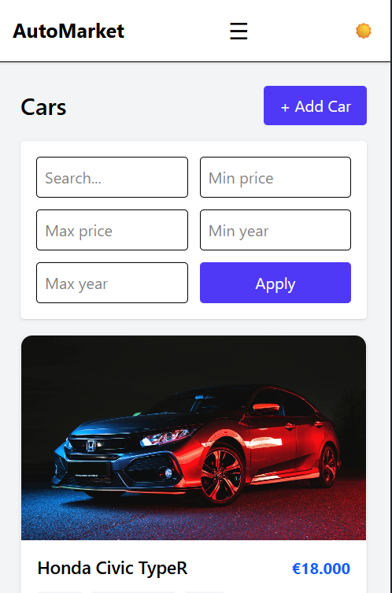
</p>

## Profile Mobile Light
<p align="center">
  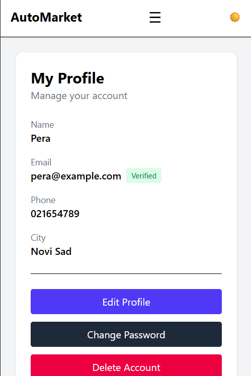
</p>

## Dark Mobile
<p align="center">
  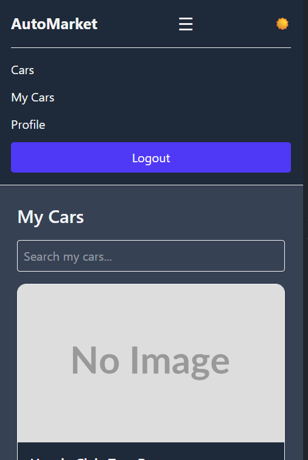
</p>
---

# Tech Stack

## Backend

* Laravel
* Laravel Sanctum
* MySQL
* Eloquent ORM
* Policies
* Form Requests
* API Resources
* Service Layer Architecture

## Frontend

* TypeScript
* TailwindCSS
* Custom SPA Router
* Axios
* Responsive Layout
* Dark/Light Theme

---

# Features

## Authentication & Security

* User registration
* Login / logout
* SPA authentication with Sanctum
* Email verification
* Password reset flow
* Route protection
* Profile management
* Password change
* Account deletion

## Car Marketplace

* Create car listings
* Edit listings
* Delete listings
* Multiple image uploads
* Primary image selection
* Car details page
* My Cars page
* Image cleanup on deletion
* Image format to Webp

## UI / UX

* Responsive mobile navigation
* Dark / Light mode
* Toast notifications
* Reusable layout system
* SPA navigation without page reloads
* Mobile-friendly design

---

# Architecture

## Backend Architecture

The Laravel backend follows a clean and scalable structure:

* Controllers handle HTTP requests
* Form Requests handle validation
* Services contain business logic
* Policies handle authorization
* Resources transform API responses
* Sanctum handles SPA authentication

## Frontend Architecture

The frontend is built as a custom TypeScript SPA:

* Custom router system
* Centralized auth store
* Reusable layout components
* Dynamic route rendering
* API layer separated from UI
* Responsive UI with TailwindCSS

---

# Project Structure

```txt
/backend
  Laravel API

/frontend
  TypeScript SPA
```

---

# Installation

## Backend Setup

```bash
cd backend
composer install
cp .env.example .env
php artisan key:generate
php artisan migrate --seed
php artisan storage:link
php artisan serve
```

---

## Frontend Setup

```bash
cd frontend
pnpm install
pnpm dev
```

---

# Environment Variables

## Backend

Example:

```env
APP_URL=http://127.0.0.1:8000
FRONTEND_URL=http://127.0.0.1:5173

SESSION_DOMAIN=127.0.0.1
SANCTUM_STATEFUL_DOMAINS=127.0.0.1:5173
```

## Frontend

```env
VITE_API_URL=http://127.0.0.1:8000
```

---

# Production Deployment

The project is designed to be deployed as:

* Frontend SPA build
* Laravel API backend
* Shared hosting compatible

Production setup includes:

* HTTPS
* Sanctum SPA authentication
* Laravel storage linking
* Frontend build deployment
* SPA routing configuration

---

# Future Improvements

Planned improvements:

* Favorites / wishlist
* Admin dashboard
* Performance optimization

---

# Author

Designed and developed by Bojan Đurđević.
